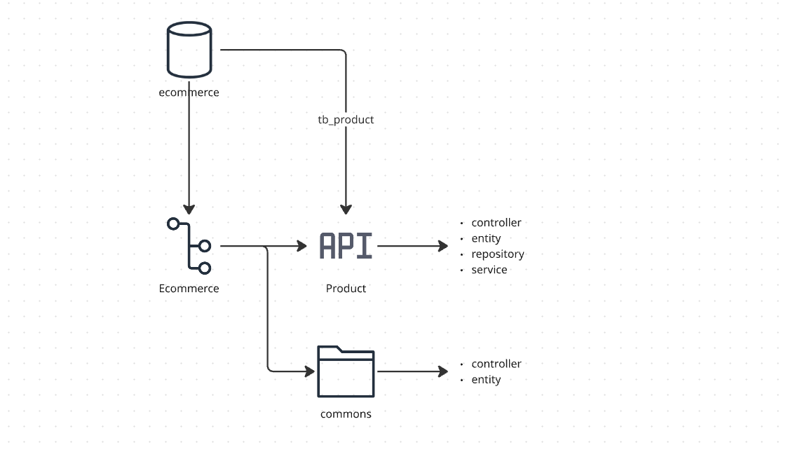

# E-commerce Product API

A Spring Boot REST API for managing products in an e-commerce platform.

# Team
- Leonardo Schunck Rainha - 99902
- Kayky Oliveira Schunck - 99756
- Ricardo Augusto de Matos Filho - 95906
- Felipe Voidela Toledo - 98595
- Paulo Lopes Junior - 551137

## Technologies

- Kotlin 1.8
- Spring Boot 3.x
- Spring Data JPA
- Gradle
- PostgreSQL
- Jakarta Validation

## Setup & Running

1. Clone the repository
2. Run docker-compose `docker compose up -d`
3. Configure database in `application.properties`:
```properties
spring.datasource.url=jdbc:postgresql://localhost:5432/ecommerce
spring.datasource.username=your_username
spring.datasource.password=your_password
```
4. Run: `./gradlew bootRun`

## Link Postman
[Postman Collection](https://app.getpostman.com/join-team?invite_code=722c6c34bfe18ba768dbf01606de03f7d7c8b526d1f78d5984aeb109e922cc9f&target_code=a7a729a2e4f49b1be6f46e6de30b715a)

## API Endpoints

### Register Product
```http
POST /v1/products
```
**Request:**
```json
{
  "name": "Smartphone XYZ",
  "description": "Latest model",
  "category": "TECHNOLOGY",
  "price": 999.99,
  "amountAvailable": 50
}
```
**Response:** `201 Created`
```json
{
  "id": "123e4567-e89b-12d3-a456-426614174000",
  "name": "Smartphone XYZ",
  "description": "Latest model",
  "category": "TECHNOLOGY",
  "price": 999.99,
  "amountAvailable": 50
}
```

### List Products
```http
GET /v1/products?page=0&size=10&productName=phone&productCategory=TECHNOLOGY
```
**Response:** `200 OK`
```json
[
  {
    "id": "123e4567-e89b-12d3-a456-426614174000",
    "name": "Smartphone XYZ",
    "category": "TECHNOLOGY",
    "price": 999.99,
    "amountAvailable": 50
  }
]
```

### Get Product
```http
GET /v1/products/{id}
```
**Response:** `200 OK`
```json
{
  "id": "123e4567-e89b-12d3-a456-426614174000",
  "name": "Smartphone XYZ",
  "description": "Latest model",
  "category": "TECHNOLOGY",
  "price": 999.99,
  "amountAvailable": 50
}
```

### Update Product
```http
PUT /v1/products/{id}
```
**Request:**
```json
{
  "price": 899.99,
  "amountAvailable": 45
}
```
**Response:** `204 No Content`

### Delete Product
```http
DELETE /v1/products/{id}
```
**Response:** `204 No Content`

## Error Handling

The API uses standard HTTP status codes and returns error responses in the following format:

```json
{
  "message": "Error description",
  "status": 400,
  "errors": [
    {
      "error": "Field specific error",
      "field": "fieldName"
    }
  ]
}
```

# Diagram

